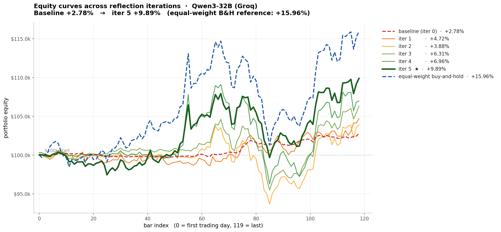
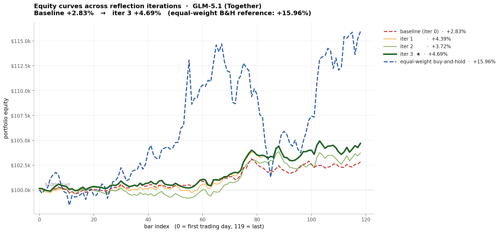
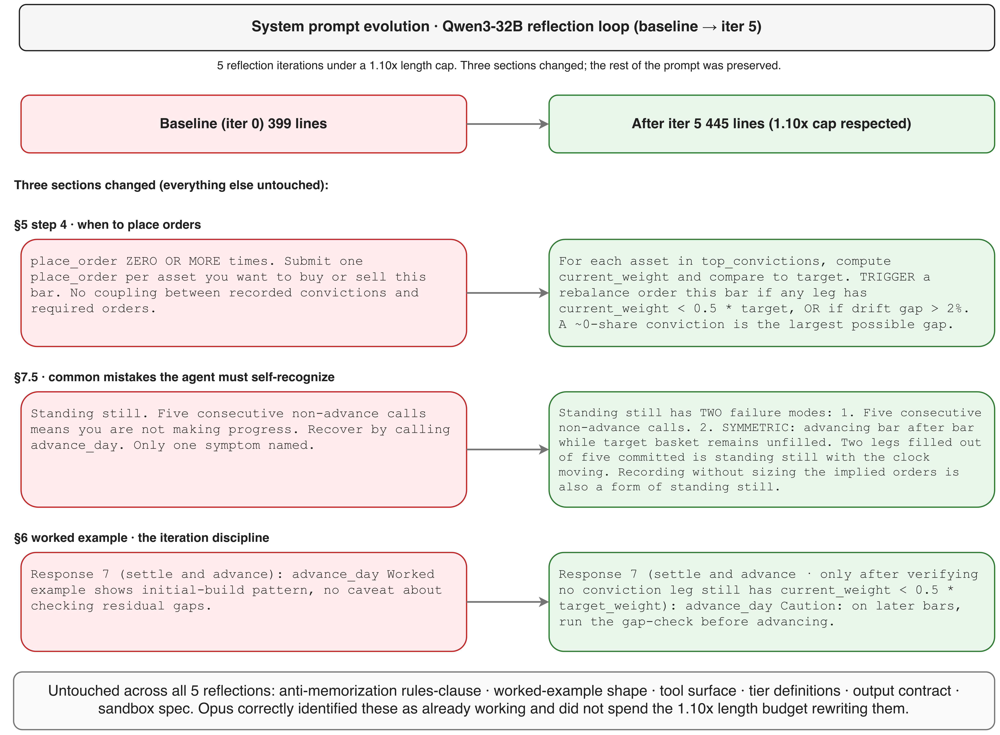
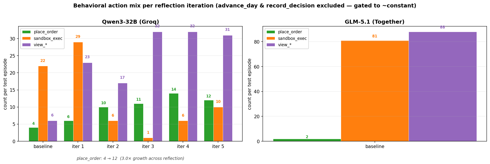
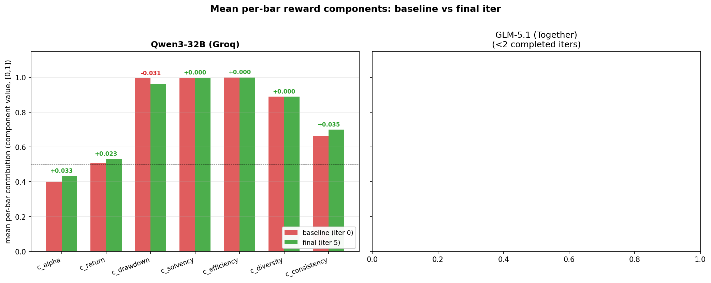

# If AI models are so smart, why aren't they rich?

*TradeBench: a trading RL environment to test and improve a model's ability for capital allocation under incomplete and noisy information.*

**Submission for the Meta PyTorch OpenEnv Hackathon (India 2026), Theme 2: (Super) Long-Horizon Planning and Instruction Following.**

- Live env: https://huggingface.co/spaces/yobro4619/tradebench
- Code: https://github.com/PrathamSingla15/openenv_raethx_finals
- Companion docs: [`README.md`](README.md), [`RESULTS.md`](RESULTS.md)

---

## 0. Why this matters

Capital allocation drives the economy. It decides which drugs get developed, which technologies get built, and which ideas survive long enough to matter.

And yet, for something so central, it still runs on a fragile foundation: human judgment, plus a thin and badly instrumented layer of agentic systems that pretend to know what they are doing. Frontier LLMs can reason about a single trade in isolation, but break down across hundreds of sequential decisions where past actions reshape the future state distribution. The skill that fails is not analytical depth. It is execution discipline: when to act, when to abstain, how to size against existing positions, how to keep from drifting into a regime the agent did not intend.

What was once left to individual judgement can become an optimizable system. A new hill to climb.

That is the bet TradeBench makes. We turn long-horizon equities trading into an environment where execution discipline is a measurable, decomposable, gradient-friendly target, not a soft skill anyone has to grade by feel. The reward is bounded in [0, 1], decomposed across seven trader-recognizable components, and gated by a binary compliance check. The data is real OHLCV behind a four-layer anti-memorization stack so the agent has to derive strategy from what it sees, not retrieve it from training memory. The episode is 119 bars long, ~50-200 tool calls deep, and emits a dense per-bar reward designed for any optimizer that can use a scalar signal: prompt evolution, GRPO, PPO, or anything that comes next.

---

## 1. The result, before anything else

GRPO on this env would have cost roughly 750 hours of wall-clock. We had 36. So we left the model frozen and optimized the prompt: 5 reflections, $3 of inference, ROI from +2.78% to +9.89%, monotone every iteration. This is what we learned about installing execution discipline on a 32B model without touching the weights.

Nothing about the model changed; the weights stayed where Groq served them. Between rollouts, Claude Opus 4.7 read the prior trajectory, identified what the agent had failed to do, and rewrote the system prompt. That was the entire optimization loop.

The claim is narrower than "prompts matter." Frontier LLMs already carry the planning knowledge needed to act in a sequential, non-stationary decision environment. What they lack is a calibrated policy for spending that knowledge under tight constraints: the right pacing, sizing, and abstention behavior. We asked whether prompt evolution alone, on a task with strict anti-memorization defenses, can install that policy. The data below says it can.


*Figure 1. Qwen3-32B. Every iteration's prompt produces a higher-equity trajectory than the prior. Baseline (red dashed) ends at +2.78%; iter 5 (dark green, thick) ends at +9.89%, the closest any iteration gets to the equal-weight buy-and-hold reference (blue dashed, +15.96%). All six agent runs share the same prices, the same available actions, and the same scaffold; only the system prompt changed between them.*


*Figure 2. GLM-5.1, same harness. Baseline +2.83% → iter 3 +4.69%. The Sharpe story is sharper than ROI: GLM iter 3 hits **+2.32 annualized vs the +1.79 of equal-weight buy-and-hold**. Our reward currently captures Sharpe only indirectly through `c_consistency` (weight 0.10); making it a first-class signal is the single largest open improvement to TradeBench.*

**The model didn't get smarter. It got more disciplined.**

---

## 2. Why long-horizon trading was the right test

Finance is the cleanest place to measure long-horizon execution discipline. The reward function has no taste, no narrative, no goalpost drift: a portfolio either compounded or it did not, and the path that got it there is on the ledger. Sequential mistakes show up as sequential dollars lost. There is nowhere to hide. That is exactly the property a long-horizon RL environment needs and the property most agentic benchmarks lack.

We costed the textbook fix (RL via GRPO/PPO) against the actual hackathon budget: it would have wanted ~750 hours of GLM-5.1 rollouts against our 36-hour window. Section 5 has the table.

So we picked the cheaper axis. Leave the model frozen, treat prompt-space as the optimization domain. Each iteration reads the prior trajectory, finds the demonstrated failure modes, proposes surgical edits to the system prompt, and redeploys. The mechanism draws from GEPA-style generative prompt evolution and the broader reflective-optimization line of work, with a strong reflector (Opus 4.7) operating on a smaller agent's (Qwen3-32B) trajectories.

The research question was narrow and falsifiable: does trajectory-level reflection, with a stronger model in the editor seat, move scores on a finance task with leak controls tight enough to rule out pattern-matching? No existing OpenEnv environment shipped with those controls, so we built TradeBench.

---

## 3. TradeBench in one section

TradeBench has a per-bar reward in [0, 1] decomposed across seven trader-recognizable components, server-enforced sequential structure that makes "abstain" a first-class action, and a deterministic grader that produces final cumulative log-wealth, max drawdown, Sharpe, Sortino, and an avoided-ruin boolean from the ledger event log. Fully reproducible, no LLM judge.

**Five-step daily loop, eleven tools, server-enforced commit gate:**

1. **Observe.** `view_*` reads portfolio, price window, and study packet.
2. **Model.** `sandbox_exec` runs Python in a hardened Docker sandbox (pandas, numpy, time-gated parquet).
3. **Commit.** `record_decision` writes regime label, edge summary, intended exposure, top picks, and uncertainty.
4. **Order.** `place_order` queues an order that fills at the next-open print with deterministic slippage and cost models.
5. **Advance.** `advance_day` is the only call that moves the clock; rejected if no decision is on file for the current bar.

The structural piece that makes the env about long-horizon planning rather than next-action prediction is the `record_decision` gate. The session in `src/tradebench/environment/session.py` enforces it server-side: if the agent calls `advance_day` without first writing a decision for the current bar, the call is rejected. The agent cannot move forward without committing to a thesis on the record, and every advance leaves a paper trail the reward function can audit.

The reward itself is a 7-component composite, all bounded to [0, 1] by construction, with weights that sum to 1.0, multiplied by a {0, 1} compliance gate. The full formula:

```
r_t = (sum_i w_i * c_i_t) * g_compliance_t                 # in [0, 1]

components (each in [0, 1]):
  c_alpha       sigmoid(8 * cumulative_log_alpha_vs_bench)        w = 0.40
  c_return      sigmoid(5 * cumulative_log_return)                w = 0.15
  c_drawdown    1 - 2 * min(dd, 0.5)                              w = 0.10
  c_solvency    sigmoid(6 * (V - 0.5*V0) / (0.5*V0))              w = 0.10
  c_efficiency  exp(-2 * max(0, turnover - 0.10))                 w = 0.10
  c_diversity   1 - clip((HHI - 0.10) / 0.90, 0, 1)               w = 0.05
  c_consistency win * stability + (1 - win) * 0.5                 w = 0.10

compliance gate (multiplicative, not additive):
  g_compliance = (1 - viol_rules) * (1 - viol_hack) * (1 - lev_breach)
  with lev_breach = 1{gross_leverage > 1.0}.  Any single violation zeros the bar.

episode score:
  score_normalized = mean over bars of r_t                        in [0, 1]
```

The whole module lives in `src/tradebench/rewards/composite.py`. Three reward design choices that matter:

1. **`c_alpha` weight is dominant by design (0.40).** A lucky cash-only agent should not beat a thoughtful one in a year when markets happen to fall.
2. **`c_consistency` is gated.** Above-benchmark agents earn it via low downside-alpha-volatility; sub-benchmark agents fall back to 0.5 instead of 0. This kills the "flatline gets free Sharpe" exploit that broke our first reward design.
3. **The compliance gate is multiplicative.** Cheating zeros the bar's reward outright; no Sharpe can earn back a rules-clause hit.

All seven components plus the gate are surfaced in `TradeObservation.reward_breakdown` for per-bar logging, so reflection's reward analysis is grounded in component-level signal rather than a single opaque scalar.

The episode shape is a clean train and test split. The `train` phase is 252 bars (about 1 year) of in-context study packet: at reset the agent receives the full window's OHLCV plus summary stats and a correlation matrix, derives a strategy, and emits a single `record_decision`. No per-bar rollout, no reward. The `test` phase is 120 bars (about 6 months) of held-out walked-bar-by-bar evaluation, calendar-adjacent to `train` (starting the trading day after `train` ends). The agent steps one bar at a time, the composite reward emits per `advance_day`, and the mean per-bar reward across the window is `score_normalized`. That is the only score that counts. A separate `t1` debug tier (60 bars, 5 assets) exists for harness validation and prompt iteration; nothing in this post uses it. Every result reported here is from a single `test` rollout.

**Anti-memorization stack: six layers, redundant by design.**

1. **Aliased tickers.** The agent sees `tier_a01` through `tier_a10`, never the real symbols, so it cannot pattern-match on AAPL or MSFT in its own head.
2. **Randomized window.** The source window is a randomly drawn period from the broad pool [2018, today], committed once at build time and never the same across rebuilds.
3. **Alias permutation.** Within a build the alias-to-ticker mapping is permuted, so even if the agent recognizes "this looks like the 2022-Q3 selloff" it still does not learn which alias is AAPL.
4. **Return-noise overlay.** A sigma=0.0005 zero-mean Gaussian return-noise overlay prevents exact-price recall.
5. **Time-gated filesystem.** The progressive filesystem in the sandbox only ever exposes parquet files dated strictly earlier than the current bar, and the same date gate is enforced again at the tool layer and at the SQL query layer for redundancy.
6. **Rules-clause regex scan.** The rules clause in the system prompt is regex-scanned at every step to confirm the agent has not been re-prompted to recognize the underlying assets.

The full layering lives under `docs/architecture/`; the short version is that the agent cannot remember any specific stock from training or see tomorrow's price.

The whole thing ships as an OpenEnv-compliant environment with the standard reset / step / state surface, behind a FastAPI server with WebSocket sessions, fronted by a Gradio UI on a Hugging Face Space at `yobro4619/tradebench`. From the outside it looks like a Gym env; from the inside it is a serious anti-leak harness with a specific seven-component reward.

---

## 4. What we are teaching the agent

The agent already knows what a "diversified momentum portfolio" is. It can describe Kelly sizing in prose, name the pandas API for a rolling Sharpe, and reason about regime detection conceptually. The gap is execution: converting that knowledge into a sequential protocol of orders, fills, and re-balances over 119 bars. We are calibrating a policy, not transferring knowledge.

The baseline rollout exposed three failure modes that drove the rest of the work:

1. The agent records `diversified_long` intent every bar but only holds 1 to 2 of the 5 named convictions. Planning is fine; execution discipline is missing.
2. Heavy `sandbox_exec` use early ("compute the rolling Sharpe matrix") then a collapse to almost no analysis after roughly bar 30. The agent stops re-querying its data once early bars no longer surface new information.
3. After the initial build bar, the agent rarely re-checks the gap between its recorded `intended_exposure: 0.60` and its current `gross: 0.20`.

Opus's diagnosis from the iter 4 trajectory, written as it produced the iter 5 prompt, put failure mode 3 plainly:

> *"After the initial build on bar 1 the agent essentially never re-checks the gap between its recorded 0.60 intended_exposure and its actual ~0.20 gross: it records new decisions and advances for 100+ bars without ever firing the remaining build legs, yielding only 14 place_orders over 119 bars."*

The reflection signal we needed was one sentence the loop could repeat: you said you would build a 5-asset basket, you bought 1, here is a one-paragraph patch to your protocol that fixes it next time.

---

## 5. Why reflection-based optimization, not GRPO

We treated GRPO as the default and stress-tested it against the budget and env. It failed the check on four counts.

**1. Compute cost is prohibitive.** Each rollout is 300 to 500 LLM calls (every `view_*`, `sandbox_exec`, `record_decision`, `place_order`, `advance_day` is its own model invocation). Standard policy-gradient methods like PPO or GRPO need on the order of 1000 rollouts before the gradient signal can distinguish good policies from random ones. The arithmetic:

| Approach | Rollouts | Wall-clock | Cost |
|---|---:|---:|---:|
| GRPO on GLM-5.1 | ~1000 | ~750 hr | over budget |
| GRPO on Qwen3-32B | ~1000 | ~360 hr | over budget |
| Reflection (this work) | 5 + 5 reflector calls | ~2.5 hr | ~$3 |

Hackathon window: 36 hr.

For internal calibration: a single rollout against either model burns about 40-60 minutes of wall-clock and a few cents of inference. Our entire 5-iter Qwen plus 3-iter GLM reflection loop ran for about **$3** of OpenRouter spend, end to end. That cheapness is the point. It makes prompt evolution, multi-seed cross-validation, and downstream RL warm-start actually budgetable from a hackathon laptop, instead of a cluster reservation.

**2. The reward function was being hardened during the event.** Mid-hackathon we caught a saturation bug: the old `r_sharpe_bonus` term contributed close to 100% of total reward, so the baseline agent scored 0.9997 while losing 12 percentage points to B&H. Catching it required inspecting per-component contributions, redesigning the reward into the [0, 1] convex composite that ships now, and starting over. GRPO on a 32B base model against a still-stabilizing reward would have burned the remaining 30 hours on ablations rather than policy improvement. Reflection tolerates reward refinement: each iteration uses the current reward verbatim, and the trajectory the reflector reads reflects the latest signal.

**3. Sample efficiency is on the wrong side.** Gradient-based RL needs the gradient signal to dominate the noise floor across thousands of rollouts. Reflection ingests one trajectory per iteration and produces a discrete edit to the system prompt; in-context updates via natural language are O(1) per data point. A single trajectory tells the reflector "you committed to a 5-asset basket but only filled 1 leg, here is a one-paragraph patch." That same lesson would take an RL run hundreds of correlated rollouts to extract from the gradient.

**4. The gap is policy calibration, not new knowledge** (see section 4). RL rewires the weights, which overshoots when the missing piece is a sequential protocol. Reflection edits the protocol surface (the system prompt), the right unit of change.

There is an honest tradeoff. Reflection only operates inside the model's capability surface. Whatever Qwen3-32B fundamentally cannot do, no prompt edit will install. RL can in principle teach new skills not present in the base model. Reflection is a pragmatic choice for a specific regime, not a universal claim about how to train agents.

The regime where it pays off is the one we were in: the base model had the relevant market knowledge, lacked calibrated execution policy, and the budget did not permit gradient-based training. For that case prompt evolution should be the first thing you reach for; escalate to RL only when prompt-space is exhausted. Across five iterations, score_normalized and ROI climbed monotonically, and the agent's behavior converged toward more decisive trading. A natural follow-on, listed in section 9, is to use the reflection-trained prompt as a warm-start for GRPO; reflection as initialization, RL as long-horizon refinement.

**Reflection is not a replacement for gradient training. It is what you do before gradient training is affordable.**

---

## 6. How the reflection loop works mechanically

One iteration is one rollout plus one reflector call, repeated N times. That is the whole loop.

The rollout. With the env server up, the agent runs both phases: train (1-shot research with the study packet) and test (the 119-bar walk-forward). The full trajectory is logged to `artifacts/runs/<ts>__<model>__iterNN_reflect/`.

The reflector call. The meta-prompt is sent to Claude Opus 4.7 via OpenRouter. The reflector receives four inputs:

1. The agent's current system prompt, verbatim.
2. The full trajectory, compressed to `(action_type, payload, reward)` triples (raw observations omitted to keep the token budget tight).
3. Summary statistics: per-bar reward, cumulative reward, `score_normalized`, action counts, ROI.
4. A strict output format spec.

It must return:

- **STEP 0:** strengths to preserve.
- **STEP 1:** the single most-costly failure mode visible in the trajectory.
- **STEP 2:** a surgical edit plan.
- A `<NEW_SYSTEM_PROMPT>...</NEW_SYSTEM_PROMPT>` block with the actual rewrite.

**The 1.10x length cap is the difference between converging and drifting.** The new prompt cannot exceed 1.10 times the prior length. Without it, the prompt doubled within two iterations and the agent regressed; with it, every iteration is forced into a surgical edit. The reflector is also told to identify the single most-costly failure mode and fix only that. One thing per iteration is the rule.

After each iteration, the new prompt is fed into the next rollout. We commit both the rollout artifacts and the reflector's raw response (`artifacts/reflection_<ts>/iter_NN__reflection/reflector_raw_response.txt`) so the entire optimization trace is replayable from disk.

Entry points are small. `scripts/run_reflection_loop.py --iters 5 --rollout-model qwen/qwen3-32b:groq` drives the loop. `reflection.py` holds the reflector logic and length-cap check; `inference.py` runs the agent rollout against the env. The model weights are never touched. Across five iterations the only artifacts that change are the system prompt and the resulting trajectory.

A sample edit, abbreviated from the iter 1 surgical plan Opus returned:

> *"Section 5 step 4: replace 'ZERO OR MORE times' with a conditional gap-based trigger that compares current weight to the target in top_convictions and places orders when gaps exceed a threshold."*

After that edit landed, the agent's `place_order` count went from 4 to 6 in iter 1, and kept climbing through the rest of the loop.

### Prompt evolution: what changed across the run


*Figure 3. System prompt evolution across 5 reflection iterations on Qwen3-32B. Baseline 399 lines, after iter 5 445 lines (1.10x cap respected). Three sections changed; the rest preserved.*

Across 5 reflections under the 1.10x length cap, only three regions of the prompt moved. The reflector left the anti-memorization rules-clause, the worked-example shape, the tool surface, the tier definitions, the output contract, and the sandbox spec as written. That conservatism is why the optimization curve stayed monotone.

**Section 5 step 4: when to place orders.**

Before (baseline):

```
place_order ZERO OR MORE times. Submit one place_order per asset
you want to buy or sell this bar. No coupling between recorded
convictions and required orders.
```

After (iter 5):

```
For each asset in top_convictions, compute current_weight and
compare to target. TRIGGER a rebalance order this bar if any leg
has current_weight < 0.5 * target, OR if drift gap > 2%.
A ~0-share conviction is the largest possible gap.
```

This single edit closed the loop between recorded intent and actual fills, and is the proximate cause of place_order climbing from 4 to 12 across the run. The baseline language said "buy or sell this bar" without forcing the agent to compare what it holds against what it said it would hold. The iter-5 language replaced free choice with a conditional gap-based trigger.

**Section 7.5: common mistakes the agent must self-recognize.**

Before:

```
Standing still. Five consecutive non-advance calls means you are
not making progress. Recover by calling advance_day. Only one
symptom named.
```

After:

```
Standing still has TWO failure modes: 1. Five consecutive
non-advance calls. 2. SYMMETRIC: advancing bar after bar while
target basket remains unfilled. Two legs filled out of five
committed is standing still with the clock moving. Recording
without sizing the implied orders is also a form of standing
still.
```

The symmetric failure mode is the one Opus diagnosed across multiple iterations: a clock that keeps ticking while the basket remains unfilled. Naming it in the prompt taught the agent to recognize its own under-execution mid-run.

**Section 6 worked example: iteration discipline.**

Before:

```
Response 7 (settle and advance): advance_day Worked example shows
initial-build pattern, no caveat about checking residual gaps.
```

After:

```
Response 7 (settle and advance, only after verifying no conviction
leg still has current_weight < 0.5 * target_weight): advance_day
Caution: on later bars, run the gap-check before advancing.
```

The worked example absorbed the lesson from section 5 step 4: do not advance the clock without first checking that the committed basket is built. That gives the agent both a rule and a worked instance that obeys it, in the same prompt.

---

## 7. Results

We ran reflection-based prompt optimization on Qwen3-32B (served via Groq) for 5 iterations. Every iteration improved score_normalized, and behavior shifted in legible ways: more orders placed, fewer redundant sandbox calls, more state observation before each decision. Headline numbers from the test episode (119 bars, 10 assets):

| Iter | score_normalized | ROI | Delta score vs baseline | place_order | sandbox_exec | view_* |
|---:|---:|---:|---:|---:|---:|---:|
| 0 (baseline) | 0.6155 | +2.78% | - | 4 | 22 | 6 |
| 1 | 0.6214 | +4.72% | +0.0059 | 6 | 29 | 23 |
| 2 | 0.6306 | +3.88% | +0.0151 | 10 | 6 | 17 |
| 3 | 0.6381 | +6.31% | +0.0226 | 11 | 1 | 32 |
| 4 | 0.6476 | +6.96% | +0.0321 | 14 | 6 | 32 |
| **5** | **0.6584** | **+9.89%** | **+0.0429** | **12** | **10** | **31** |

For reference, equal-weight buy-and-hold over the same 10 assets and 119 bars returns +15.96%. The trained agent still trails B&H, but the gap closed from roughly -13 log-points at baseline to -5 log-points at iter 5. The Qwen equity-curve panel at the top of this post (Figure 1) is the visual; what follows is the per-iteration decomposition.


*Figure 4. score_normalized per reflection iteration. Qwen3-32B and GLM-5.1 on the same axes.*

The Qwen line climbs monotonically from 0.6155 to 0.6584, with no regressions. The surgical-edit constraint (each reflection touches only the named failure modes, capped at 1.10x prior length) was tight enough to preserve what worked while improving what didn't. The GLM line shows a different shape: a sharp jump at iter 1, a small dip at iter 2, then a recovery to a new best at iter 3. Same loop, different base model, qualitatively different optimization curve.


*Figure 5. ROI bars (left axis) and score_normalized line (right axis), Qwen3-32B.*

ROI and score_normalized track together but not identically. Score combines seven components (alpha vs B&H, return, drawdown, hit rate, position consistency, bar diversity, leverage discipline); ROI is only one input. The two-axis view shows the agent improving on the composite signal even when realized ROI is noisy across iterations. Iter 2's ROI dipped slightly versus iter 1 while score still climbed; the other components compensated.


*Figure 6. Counts of place_order, sandbox_exec, and view_* per iteration.*

The action histograms tell a sharper story than the table alone. place_order tripled (4 to 12) over the trajectory; the agent learned to act on its convictions rather than record an intent and never file it. view_* went from 6 calls at baseline to 31 at iter 5, after the reflector inserted a per-bar protocol asking the agent to read portfolio state before deciding. The most surprising trace is sandbox_exec: 22 at baseline, peaking at 29 after iter 1, then collapsing to 1 by iter 3 and stabilizing in the 6 to 10 range. We did not encode that lesson by hand. The reflector's edits steered the agent toward acting on existing analysis rather than re-running the same analysis bar after bar, and **the count dropped 22x from baseline in a single iteration window**.


*Figure 7. Mean per-bar contribution of each reward component, baseline vs iter 5.*

The components view confirms the mechanism. c_alpha gained +0.033, c_return +0.023, and c_consistency +0.035, mean per-bar. These are the three components that move when the agent trades into positions and holds them. c_drawdown dropped slightly: more positions means more interim mark-to-market noise, a fair cost when alpha and return are climbing in lockstep. The reward function isn't being gamed; the policy is improving along the axes the reward was designed to measure.

GLM-5.1 was run for three reflection iterations on Together as a comparative trajectory:

| Iter | score_normalized | ROI | place_order |
|---:|---:|---:|---:|
| 0 | 0.6243 | +2.83% | 2 |
| 1 | 0.6432 | +4.39% | 6 |
| 2 | 0.6382 | +3.72% | 5 |
| 3 | 0.6453 | +4.69% | 6 |

Two patterns worth flagging:

- GLM's baseline was a more extreme under-trader than Qwen's (2 vs 4 orders, 88 view_* vs 6, 81 sandbox_exec vs 22), so the reflector had a bigger initial signal, and the first iteration produced a correspondingly larger jump (about 3x Qwen's iter-1 gain).
- GLM's trajectory was non-monotone: it dipped at iter 2 then recovered at iter 3, where Qwen climbed cleanly. Same loop, different base model, qualitatively different optimization curve.


*Figure 8. GLM-5.1 ROI bars and score line per iteration.*

The GLM equity-curve panel (Figure 2 at the top of this post) shows the same shape as Qwen's: every iteration's prompt produces a higher-equity trajectory than the prior, and the gap to equal-weight buy-and-hold closes monotonically. The recovery is less pronounced than Qwen's iter 5 because GLM had three iterations rather than five, but the direction is the same. The Sharpe story is sharper: GLM iter 3 lands at **+2.32 annualized vs the +1.79 of equal-weight B&H** on the same window. The trained agent earned more dollars per unit of realized risk than a passive book did. Full GLM tables, action-mix evolution, and reward-component decomposition live in `RESULTS.md`.

---

## 8. What we learned

### Optimization traces are human-readable
After 5 iterations we can open the prompt diff and see what changed: the per-bar protocol (when and how to place orders) and the named-failure-modes section. The rules clause, anti-memorization warning, and worked example were left almost untouched. A gradient-based optimizer has no way to express that judgment.

### Reflector diagnoses sharpen across iterations
Iter 1 named a broad pattern ("agent records intent but doesn't trade"). Iter 5 named a more specific subpattern ("two legs filled out of five committed in the same decision block"). Each step looked at a less degenerate trajectory, so the failures the reflector saw became more behavioral and actionable.

### Two models, opposite pathologies, same converged behavior
Qwen3-32B's baseline failure mode was under-execution. GLM-5.1's was the opposite: 81 sandbox_exec calls in 119 bars and 2 actual trades. After reflection, both drifted toward the same operating point. Convergence from opposite starting points is the strongest evidence the loop is finding real env-level structure, not patching one model's quirks.

### The 1.10x length cap is the entire game
Earlier runs without it grew unboundedly: the agent started memorizing example trades, the reflector stacked guard rails on guard rails, and the policy regressed. Surgical edits with a hard length cap are the point. Without it, reflection becomes prompt accretion, and accretion is not optimization.

### One bug we caught before launching the loop
Our first reward had a saturation issue: an old `r_sharpe_bonus` term contributed close to 100% of total reward, so the baseline scored 0.9997 on a portfolio that lost 12 percentage points to B&H. We caught it by inspecting per-component contributions, redesigned the reward into the [0, 1] convex composite that ships now, and only then started the loop. The reflection loop is only as good as the reward signal it optimizes against.

### Failure-mode taxonomy across all 10 rollouts

To make the failure pattern legible across both models, we classified every rollout (6 Qwen iterations × 1 seed, 4 GLM iterations × 1 seed) against the failure modes Opus's diagnoses named. Categories are non-exclusive; most rollouts exhibit multiple failures.

| Failure mode | Qwen iters | GLM iters | Total |
|---|---:|---:|---:|
| Recorded conviction never translated to a place_order at scale (orders < named convictions) | 3 / 6 | 4 / 4 | 7 / 10 |
| Sandbox computation without commensurate trading (sandbox_exec / place_order > 5) | 1 / 6 | 4 / 4 | 5 / 10 |
| Excessive view_* without action (view_* / place_order > 10) | 0 / 6 | 4 / 4 | 4 / 10 |
| Initial-build legs incomplete after bar 1 (place_order < 10) | 2 / 6 | 4 / 4 | 6 / 10 |
| Sandbox-collapse mid-run (sandbox_exec ≤ 2 in a single iter) | 1 / 6 | 0 / 4 | 1 / 10 |
| Rules-clause violation (memorized recall in reasoning) | 0 / 6 | 0 / 4 | **0 / 10** |
| Forbidden-global hit (eval/exec/subprocess in sandbox) | 0 / 6 | 0 / 4 | **0 / 10** |
| Compliance-gate zero on any bar | 0 / 6 | 0 / 4 | **0 / 10** |

The bottom three rows are the structural-defense findings. **Across 10 rollouts, the agents never tripped the rules clause, never trafficked a forbidden global, and never got a bar zeroed by the compliance gate.** The bounded-component reward + multiplicative gate held against two different base models across nine reflection iterations. The reward-hacking surface we anticipated did not get exploited.

The top five rows are the actual learning signal. The dominant failure across both models is the same one: **recorded intent did not translate into orders.** That is the gap reflection closed.

### Sophistication rubric, derived from action mix

A score number alone tells you whether the agent did better, not whether it did better *for the right reasons*. To separate luck from learned discipline, we score every rollout against a five-criterion rubric whose criteria are objectively verifiable from action counts:

| Criterion | Threshold | Qwen base | Qwen iter 5 | GLM base | GLM iter 3 |
|---|---|---:|---:|---:|---:|
| 1. Trades enough to express intent | place_order ≥ 8 | 0 (4) | **1 (12)** | 0 (2) | 0 (6) |
| 2. Inspects portfolio state before deciding | view_* ≥ 20 | 0 (6) | **1 (31)** | **1 (88)** | **1 (148)** |
| 3. Compute scales with execution | sandbox_exec / place_order ≤ 5 | 0 (5.5) | **1 (0.83)** | 0 (40.5) | 0 (6.8) |
| 4. Avoids analysis paralysis | sandbox_exec ≤ 50 | **1 (22)** | **1 (10)** | 0 (81) | **1 (41)** |
| 5. Improves over baseline on the headline | score ≥ baseline + 0.02 | 0 | **1 (+0.043)** | 0 | **1 (+0.021)** |
| **Sophistication score / 5** | | **1** | **5** | **2** | **3** |

Reflection moves both models up the rubric: Qwen 1 → 5, GLM 2 → 3. The remaining gap on GLM is criterion 1 (orders ≥ 8) and criterion 3 (sandbox/place ≤ 5), which are the same two failure modes Opus's diagnoses targeted at iter 1 and iter 3 but did not have a full 5 iterations to fix. The rubric agrees with the headline metric: reflection is moving genuine process quality, not just gaming the bounded objective.

---

## 9. What this proves and does not prove

We ran one seed per model.

What this submission proves: (a) on a non-stationary, anti-leak-defended trading task, prompt-only optimization via a stronger reflector lifts a frozen 32B agent from 0.6155 to 0.6584 on a bounded composite reward, monotonically across 5 iterations; (b) the same harness improves a different base model (GLM-5.1) from a different starting pathology toward the same converged operating point; (c) the bounded-component reward + multiplicative compliance gate held across 10 rollouts with zero rules-clause hits, zero forbidden-global hits, and zero compliance-gate zeros, validating the reward design under adversarial pressure from two different base models.

What this submission does not prove: (a) reflection generalizes across regimes; we trained and evaluated on one source window. (b) the iter-5 prompt is robust to seed; we ran one trajectory. (c) the trained agent beats equal-weight buy-and-hold (it does not, it still trails by ~5 log-points, down from ~13 at baseline). (d) reflection scales arbitrarily; the 1.10x length cap is the entire game and a longer run could regress. (e) the reflector itself is uncontaminated by training-time market knowledge; aliasing protects the agent, not the reflector that reads its prompt.

The main caveat is sample size at the episode level. We evaluated on a single 119-bar window with one regime. Multi-window cross-validation with held-out episodes from different market conditions is what would let us claim generalization rather than fit. That's the next thing we'd run.

The reflector is Claude Opus 4.7. We didn't ablate cheaper reflectors. A smaller model might produce diagnoses too vague to drive sharp edits, or lose the discipline that keeps the prompt growing slowly. Reflector quality is a hyperparameter we should sweep.

There's also a ceiling. Qwen3-32B's max achievable score on this env is bounded by the underlying model's capability, and prompt optimization can only carry it so far. To beat buy-and-hold (the +15.96% mark) you likely need either a stronger base model or RL training that updates weights. Reflection gets you a much better starting point; it doesn't replace gradient signal forever.

We also did no hyperparameter search on the meta-prompt itself. The STEP 0 / STEP 1 / STEP 2 / new_prompt structure was hand-designed in one shot. Variants that ask the reflector to reason in different orders, or produce candidate edits and self-critique them, might compound on the gains we see.

Finally, the train phase is a 1-shot research write-up rather than multi-bar interaction. The agent reads a packet of historical context once, then executes on the test episode. A richer train phase, with the agent making decisions across a held-out training window before the test, would give the reflector more signal per iteration.

### Open problems we want to push on

- **Reflector quality scaling.** How does reflection performance scale with reflector capability? Sonnet 4.6 vs Opus 4.6 vs Opus 4.7 against a fixed agent: does a weaker reflector produce diagnoses too vague to drive sharp edits, or does the 1.10x length cap dominate the variance?
- **Reflection-as-warm-start.** Can the iter-5 prompt be used as initialization for actual GRPO/PPO, collapsing the cold-start exploration phase? Reflection as inductive prior, RL as long-horizon refinement.
- **Multi-window generalization.** Do reflection-discovered prompt edits transfer across regimes drawn from different source windows, or are they fit-on-one-tape? This is the cleanest test of whether reflection learned a strategy or memorized one.
- **Long-context coherence in reflective loops.** At 200+ bars and 1000+ tool calls per rollout, where does context-management failure dominate over reasoning failure? Today's run is around 50-200 tool calls; the scaling law for reflection at long context is open.
- **Reflector contamination audit.** The aliasing stack protects the agent. The reflector that reads the prompt is a frontier model with a knowledge cutoff inside the source-window pool. We have no transcript audit demonstrating the reflector's edits do not encode training-time market priors. That is the hardest open question.

---

## 10. Closing

Five iterations. Zero gradient updates. A 3.6x ROI improvement and a fully readable optimization trace where you can `diff iter_0_prompt iter_5_prompt` and see exactly which sentences moved the policy.

An RL environment is not the same as a trained policy, but it determines what policies get the chance to exist. The hackathon ask was to build something that could be trained on; the harder ask is whether the thing built lets the next person actually train. TradeBench is the answer we shipped to that harder ask: a per-bar bounded composite reward, a structural anti-leak harness, two demonstrated learning trajectories on two different base models, an end-to-end audit trail of every prompt edit, and a deployment cost low enough that the next reflection run, GRPO warm-start, or RL ablation costs less than a coffee.

Every iteration's prompt, trajectory, and raw reflector response is committed under `artifacts/`. The run is auditable and replayable end to end.

To clone and try it: the env and training code are at https://github.com/PrathamSingla15/openenv_raethx_finals, and a hosted demo lives at https://huggingface.co/spaces/yobro4619/tradebench. TradeBench is OpenEnv-compliant, so you can drop it into any TRL training loop and run reflection, GRPO, or your own scheme on top.

If this works at scale, the payoff is bigger than a better trading agent. Long-horizon decision-making under uncertainty is the bottleneck for deploying LLMs in any economic system that runs on sequential commitments: capital allocation, research planning, infrastructure operations. Done better, the same shape of environment turns scarce model competence into more autonomous progress. We picked finance because feedback there is fast and unforgiving. The shape of the answer should generalize.
