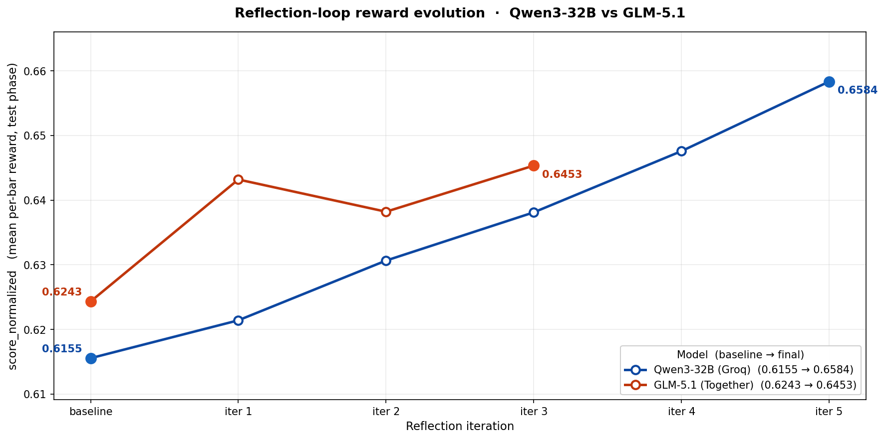
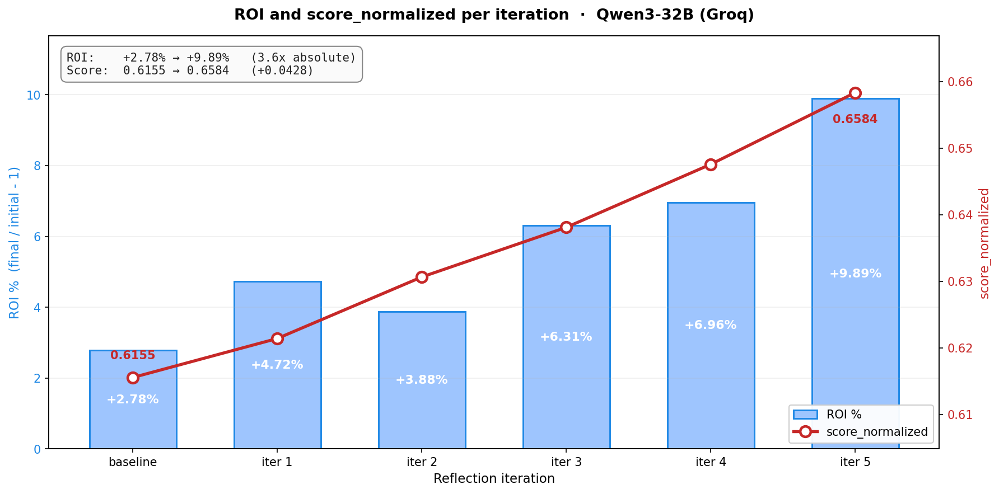
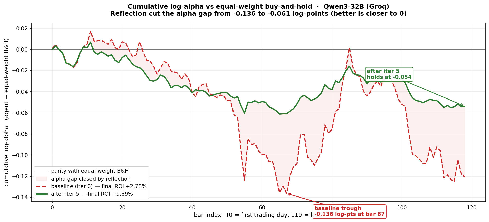
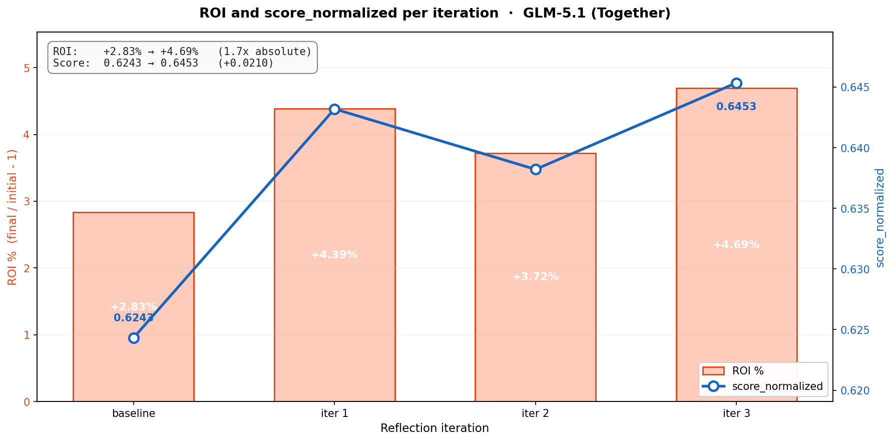
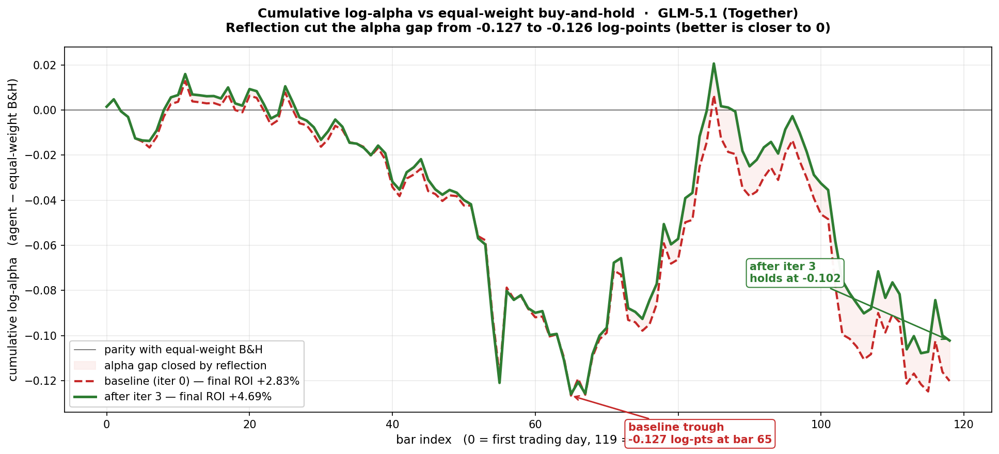

# TradeBench

**A long-horizon, non-stationary, reward-hack-resistant finance-trading RL environment for LLM agents.**

Meta PyTorch OpenEnv Hackathon (India 2026) finals submission. **Theme 2: (Super) Long-Horizon Planning & Instruction Following.**

> TradeBench is a single-agent equities-trading environment built so an LLM agent can actually learn on it: a per-bar reward in [0, 1] decomposed into seven trader-recognizable components, layered look-ahead defenses so the agent has to derive strategy from the data it sees rather than retrieve it from weight memory, and reward-hack safeguards so the score reflects real edge. We trained an agent on it via a GEPA-style reflection loop (5 iters, no gradient updates) and got a monotone score climb from 0.6155 to 0.6584 with ROI growing from +2.78% to +9.89%.

> All hackathon deliverables (deployed env, code, writeup, training notebook, long-form results) are linked in the section below.

---

## Links (submission deliverables)

| | |
|---|---|
| HF Space (deployed env) | https://huggingface.co/spaces/yobro4619/tradebench |
| Code repository | https://github.com/PrathamSingla15/openenv_raethx_finals |
| Writeup / blog post | [`Blog.md`](Blog.md) (also at `https://huggingface.co/spaces/yobro4619/tradebench/blob/main/Blog.md`) |
| Training notebook (Colab) | [`notebooks/training.ipynb`](notebooks/training.ipynb). [](https://colab.research.google.com/github/PrathamSingla15/openenv_raethx_finals/blob/main/notebooks/training.ipynb) Runs the full reflection loop end-to-end against the deployed env. Backed by [`scripts/run_reflection_loop.py`](scripts/run_reflection_loop.py). |

Other useful pointers:

- **Reflection-loop demo results (long form):** [`RESULTS.md`](RESULTS.md). Full per-iter trajectory, per-bar alpha vs B&H, action mix evolution, reward-component decomposition.
- **Architecture deep-dive:** [`docs/architecture/event-order.md`](docs/architecture/event-order.md), [`docs/sandbox/security-model.md`](docs/sandbox/security-model.md), [`docs/benchmark/metric-panel.md`](docs/benchmark/metric-panel.md).

---

## 1. Problem

Frontier LLMs fail at long-horizon, non-stationary decision-making under uncertainty. They can reason about a single trade in isolation, but break down across hundreds of sequential decisions where past actions reshape future state, correlations drift across regimes, and the model's own weights already encode the market history we want to test on. Naive backtests on familiar dates measure memorization, not skill.

TradeBench is designed so this class of agent can actually be **improved on the task** (not just scored):

- **Per-bar reward in [0, 1] by construction.** A convex combination of seven trader-recognizable components (alpha vs equal-weight buy-and-hold, cumulative return, drawdown, solvency, turnover efficiency, concentration, downside-volatility-of-bar-alpha) multiplied by a {0, 1} compliance gate. The episode score is the mean per-bar reward, also in [0, 1].
- **Long-horizon planning spine.** A server-enforced per-bar gate requires a fresh `record_decision` (regime label, edge summary, intended exposure, top convictions, uncertainty) before every `advance_day`. The agent literally cannot tick the clock without committing to a thesis on the record.
- **Layered look-ahead prevention.** SQL-level PIT filter, tool-level date gating, progressive filesystem materialization, rules-based-strategy clause with a regex scanner, aliased tickers, and a randomly drawn source window. The agent has to derive strategy from data it can see, not retrieve it from weight memory.
- **Reward-hacking safeguards.** Forbidden-global scanner over `sandbox_exec` output, hard compliance gate that zeros the bar on any rule violation, bounded leverage, per-bar turnover cap.

---

## 2. Environment

### 2.1 The five-step loop

Each trading day the agent cycles through:

1. **Observe.** Call `view_universe`, `view_portfolio`, `view_time`, `view_orders`, `view_constraints`, `view_episode_metrics` to get the current snapshot.
2. **Model.** Call `sandbox_exec` to run Python (pandas / NumPy / scikit-learn / statsmodels) in a hardened Docker container. Read-only access to Parquet catalog (PIT-filtered). No internet.
3. **Size.** Call `record_decision` with regime label, edge summary, intended exposure, top convictions, uncertainty level, and an optional `reasoning` string. `reasoning + edge_summary` are scanned by the rules-clause verifier; phrases that recall specific historical outcomes trip `r_rules = -1.0`.
4. **Place orders.** Call `place_order(client_order_id, asset_id, side, quantity)`. Orders queue; no same-bar execution.
5. **Advance.** Call `advance_day`. Orders fill at next-open with slippage + fees. Portfolio marked to close. Composite reward emitted. Next day's data becomes available.

### 2.2 Train / test split

TradeBench is a single-task environment with two splits, plus a debug tier:

| Split | Horizon | Universe | Role |
|---|---|---|---|
| `train` | 252 bars (~1 yr) | 10 aliased equities | In-context study packet. The full window (OHLCV plus summary stats and correlation matrix) is delivered at episode reset. The agent reads it, derives a strategy, and emits a single `record_decision`. No per-bar rollout, no reward. |
| `test`  | 120 bars (~6 mo) | Same 10 aliases     | Held-out walked-bar-by-bar evaluation. Calendar-adjacent to `train` (starts the trading day after `train` ends). The agent steps one bar at a time, the composite reward emits per `advance_day`, and the mean per-bar reward is the score. |

`t1` is a 60-bar / 5-asset debug tier used for harness validation and prompt iteration. It is not part of the scored split. Every result in this README is from a single `test` rollout.

The deterministic grader produces final cumulative log-wealth, max drawdown, Sharpe, Sortino, and an avoided-ruin boolean from the ledger event log. Fully reproducible, no LLM judge.

> **Real-derived, aliased, date-shifted data.** Test bars come from real OHLCV (mega-cap US tickers via yfinance) baked once by `scripts/build_real_dataset.py`. Four anti-memorization layers stack on top: (1) every asset is exposed only as `tier_a01` ... `tier_a10` aliases; real ticker symbols never appear in any tool output or sandbox file. (2) The source window is a randomly drawn period from the broad pool `[2018, today]`, committed once at build time. (3) The alias-to-ticker mapping is permuted per build, so even recognizing "this looks like 2022-Q3" does not reveal which alias is AAPL. (4) A sigma=0.0005 zero-mean Gaussian return-noise overlay prevents exact-price recall. Series are rescaled to base $75 so equal-weight sizing stays well-conditioned. The (window, ticker, permutation, noise-seed) tuple is committed privately to `datasets/real-data/aliases.json` for replay-determinism audit; `progressive_fs` walks the catalog dir and never copies it into the agent sandbox.

### 2.3 Tool surface

| Tool | Purpose | Advances time? |
|---|---|---|
| `view_universe` | Tradable assets today | No |
| `view_time` | Current date, next session | No |
| `view_portfolio` | Cash, positions, marks, value | No |
| `view_orders` | Queued + open ledger orders | No |
| `view_constraints` | Long-only, leverage caps, sizing rules | No |
| `view_episode_metrics` | Running score, drawdown, Sharpe | No |
| `record_decision` | Log regime / edge / conviction / uncertainty | No |
| `place_order` | Queue a buy/sell | No |
| `cancel_order` | Cancel a queued order | No |
| `advance_day` | Execute queued orders, settle, reveal data | **Yes** |
| `sandbox_exec` | Python/shell inside isolated Docker | No |

### 2.4 Reward (7-component convex composite × compliance gate)

Per-bar reward is in `[0, 1]` by construction. Episode score is the mean per-bar reward, also in `[0, 1]`. The seven components are each in `[0, 1]`, the seven weights sum to `1.0`, and the compliance gate is `{0, 1}`.

```
r_t = (Sum_i  w_i * c_i_t)  *  g_compliance_t

components:
  c_alpha       sigmoid(8 * cumulative_log_alpha_vs_bench)        w = 0.40
  c_return      sigmoid(5 * cumulative_log_return)                w = 0.15
  c_drawdown    1 - 2 * min(dd, 0.5)                              w = 0.10
  c_solvency    sigmoid(6 * (V - 0.5*V0) / (0.5*V0))              w = 0.10
  c_efficiency  exp(-2 * max(0, turnover - 0.10))                 w = 0.10
  c_diversity   1 - clip((HHI - 0.10) / 0.90, 0, 1)               w = 0.05
  c_consistency win * stability + (1 - win) * 0.5                 w = 0.10

compliance gate:
  g_compliance = (1 - viol_rules) * (1 - viol_hack) * (1 - lev_breach)
  with lev_breach = 1{gross_leverage > 1.0}.  Any single violation zeros the bar.

episode score:
  score_normalized = mean over bars of r_t   in [0, 1]
```

Why this shape:

- **`c_alpha` (40% weight) is the dominant signal.** It rewards the agent for cumulative log-alpha against a do-nothing equal-weight buy-and-hold portfolio. A flat-cash agent and a B&H-tracker both score below the trained agent on this axis when the trained agent generates real alpha.
- **`c_consistency` is gated.** Above-benchmark agents earn it for low downside-alpha-volatility; sub-benchmark agents fall back to 0.5. That removes the "flatline gets free Sharpe" exploit that broke the original reward.
- **The compliance gate is multiplicative, not additive.** Cheating zeros the bar's reward outright; there is no way for a great Sharpe to earn back a rules-clause hit.

All seven components plus the compliance gate are surfaced in `TradeObservation.reward_breakdown` for per-bar logging. The full module with smoke tests is at `src/tradebench/rewards/composite.py`.

### 2.5 Look-ahead prevention: layered defense

LLM weights post-date the backtest window, so a single defense is never enough. TradeBench addresses this with six independent layers:

1. **SQL-level PIT filter.** Every DuckDB query filters `available_at <= current_date`.
2. **Tool-level date gating.** Every data-view tool validates its `as_of_date` argument; requests past `current_date` are rejected.
3. **Progressive filesystem view.** Only files with `available_at <= current_date` are materialized into the sandbox read-only mount. Copy-on-reset + refresh-on-advance.
4. **Rules-based-strategy clause.** System prompt forbids memorized recalls ("I know X happened"). Enforced by regex scanner over agent reasoning.
5. **No internet in sandbox.** Network-disabled Docker, seccomp profile, non-root.
6. **Aliased + date-shifted data.** Agents see opaque `tier_a01` ... `tier_a10` IDs against a shifted source window; the underlying real series is never identifiable.

### 2.6 Reward-hacking safeguards

- **Forbidden-global scanner.** Regex on every `sandbox_exec` stdout/stderr and files the agent writes. Catches `eval`, `exec`, `__import__`, `ctypes`, `subprocess`, direct ledger attribute mutation. Trips `viol_hack = 1` and the compliance gate zeros the bar.
- **Bounded components.** Every `c_i` is in `[0, 1]` by construction, so no single component can dominate the others. There is no unbounded "log-wealth" head that an agent can chase at the expense of compliance.
- **Hard compliance gate.** Rules-clause violation, forbidden-global hit, or gross leverage above 1.0 each set `g_compliance_t = 0`, zeroing the entire bar's reward.
- **Per-bar turnover cap.** 25 trades. Prevents penny-order exploits.

---

## 3. Results: reflection-loop optimization

We trained the agent's prompt via a **GEPA-style reflection loop**: each iteration, Claude Opus 4.7 inspects the prior rollout's trajectory, identifies the single most-costly failure mode, and proposes a surgical edit to the system prompt (length capped at 1.10× the prior version). The model weights are never touched. Two open-weights base models were trained on the same harness:

- **Qwen3-32B (Groq).** 5 reflection iterations. `score_normalized` lifted **0.6155 → 0.6584** (+4.3 pp monotonic). ROI grew **+2.78% → +9.89%** (3.6× absolute).
- **GLM-5.1 (Together).** 3 reflection iterations as a comparative trajectory. `score_normalized` moved **0.6243 → 0.6453** (best at iter 3, with a small dip-then-recover shape). ROI grew **+2.83% → +4.69%**.

**Headline plot. Both models, every iteration on one axes:**



**Qwen3-32B (Groq) per-iter detail:**





The bar-alpha plot is the most informative single chart for "what reflection actually taught the agent". Baseline (red dashed) bled alpha to B&H all the way to −13 log-points by bar 119. Iter-5 (green) cut that gap to −5 log-points and held flat across the back half of the episode.

| Qwen3-32B iter | Score | ROI | place_order | sandbox_exec | view_* |
|---:|---:|---:|---:|---:|---:|
| baseline | 0.6155 | +2.78% | 4 | 22 | 6 |
| iter 1 | 0.6214 | +4.72% | 6 | 29 | 23 |
| iter 2 | 0.6306 | +3.88% | 10 | 6 | 17 |
| iter 3 | 0.6381 | +6.31% | 11 | 1 | 32 |
| iter 4 | 0.6476 | +6.96% | 14 | 6 | 32 |
| **iter 5** | **0.6584** | **+9.89%** | **12** | **10** | **31** |

**GLM-5.1 (Together) per-iter detail:**





| GLM-5.1 iter | Score | ROI | place_order | sandbox_exec | view_* |
|---:|---:|---:|---:|---:|---:|
| baseline | 0.6243 | +2.83% | 2 | 81 | 88 |
| iter 1 | 0.6432 | +4.39% | 6 | 44 | 110 |
| iter 2 | 0.6382 | +3.72% | 6 | 19 | 182 |
| **iter 3** | **0.6453** | **+4.69%** | **6** | **41** | **148** |

GLM started from a more extreme under-trading baseline (2 orders vs Qwen's 4, 81 sandbox calls vs Qwen's 22), got a larger first-iteration boost (+0.019 vs Qwen's +0.006), and converged in 3 iters where Qwen was still climbing at 5. The full Qwen-vs-GLM head-to-head with action-mix and reward-component plots lives in [`RESULTS.md`](RESULTS.md).

---

## 4. Why it matters

- **Finance is the canonical professional long-horizon task.** Every other Theme-2 candidate (codebase refactoring, logistics, research planning) has fewer public benchmarks and murkier rewards. Finance has a clean, verifiable, alpha-vs-benchmark reward function and rich public data.
- **Training-ready, not eval-only.** Most financial LLM benchmarks score agents post-hoc. TradeBench ships a per-bar composite reward bounded in `[0, 1]`, designed for any optimizer that can use a dense scalar signal: reflection-based prompt evolution (what we ran), GRPO, PPO, or anything else.
- **Reward hacking is the real failure mode.** Most finance envs either produce so-sparse rewards that learning can't happen, or so-exploitable rewards that the agent games them. TradeBench's bounded-component design + multiplicative compliance gate + forbidden-global scanner pins down both.
- **Anti-memorization is structural, not aspirational.** Aliased universe + randomly drawn source window + per-build alias-ticker permutation + return noise + post-cutoff option means the agent has to derive strategy from the data it sees, not retrieve it from weight memory.

---

## 5. Architecture

```
+-----------------------------------------------------------------+
|        OpenEnv client (TradeBenchEnv from client.py)            |
|          inference.py drives an LLM agent on top                |
|   reflection.py wraps a reflector loop (Opus 4.7 via OR)        |
+-----------------------------------------------------------------+
|             server/app.py (FastAPI via create_app)              |
|     /reset  /step  /state  /schema  /health  /docs  /ws         |
+-----------------------------------------------------------------+
|         server/tradebench_environment.py (Environment)          |
|  dispatches TradeAction -> TradeBenchSessionRuntime tool calls  |
|  composes TradeObservation (tool_output + reward_breakdown)     |
+-----------------------------------------------------------------+
|           src/tradebench/environment/session.py                 |
|   per-episode session runtime: tool dispatch, per-bar gate,     |
|   ledger projection, advance_day, sandbox_exec                  |
+-----------------------------------------------------------------+
|  rewards/          environment/             episodes/           |
|  composite.py      date_gate.py             tiers.py            |
|  anti_hack.py      progressive_fs.py        study_packet.py     |
+-----------------------------------------------------------------+
|   execution/engine.py    ledger/projector.py    data/query.py   |
|      (fills, fees)       (event -> portfolio)   (PIT DuckDB)    |
+-----------------------------------------------------------------+
|                  sandbox/providers/{docker,local}.py            |
|        seccomp - no-network - read-only root - non-root         |
+-----------------------------------------------------------------+
|                       Parquet catalog                           |
|   daily_bars - fundamentals_pti - corporate_actions - calendar  |
+-----------------------------------------------------------------+
```

**Design principle:** the environment owns all portfolio state. The agent cannot directly mutate cash, positions, or scores; it only inspects via tools and submits orders. The ledger event log is the single source of truth, and every reward component is computed deterministically from it.

---

## 6. Quickstart

### Run via Docker (mirrors the HF Spaces deployment exactly)

```bash
docker build -t tradebench:latest .
docker run -p 8000:8000 tradebench:latest

curl http://localhost:8000/health
# -> {"status":"healthy"}

# Open the UI
open http://localhost:8000/
```

### Local development (Python)

```bash
git clone https://github.com/PrathamSingla15/openenv_raethx_finals.git
cd openenv_raethx_finals
uv sync --extra openai

# Run the OpenEnv server locally
uv run uvicorn server.app:app --host 0.0.0.0 --port 8000 --reload
# -> http://localhost:8000/      Gradio UI with 7 tabs
# -> http://localhost:8000/docs  OpenAPI / Swagger
```

### Run a deterministic baseline (no LLM required)

```bash
# Drives the env with cash-only / equal-weight / Kelly policies via src/tradebench/baselines/
uv run python -c "from tradebench.baselines.equal_weight import run; run('test')"
```

### Run the LLM driver (HuggingFace Inference Providers, default)

```bash
export ENV_URL="http://127.0.0.1:8000"            # or the deployed HF Space
export HF_TOKEN="hf_..."                          # for HF Inference Providers (Groq / Together)
export MODEL_NAME="qwen/qwen3-32b:groq"           # alternatives: zai-org/GLM-5.1:together
uv run python inference.py
# Drives the agent through train + test phases, writes artifacts/runs/<ts>__<model>/.
```

### Run the reflection loop (5 iterations)

```bash
export OPENROUTER_API_KEY="sk-or-..."             # for the Opus 4.7 reflector
export HF_TOKEN="hf_..."                          # for the agent rollout
export ENV_URL="http://127.0.0.1:8000"
uv run python scripts/run_reflection_loop.py \
    --iters 5 \
    --rollout-model qwen/qwen3-32b:groq

# Continue from a prior run instead of starting fresh
uv run python scripts/run_reflection_loop.py --iters 5 \
    --from-run artifacts/runs/<prior_run_id> \
    --rollout-model qwen/qwen3-32b:groq
```

### Run the verifier (assert env claims)

```bash
uv run python -m tradebench.verifier --tier test --seed 42
# RESULT: PASS  ->  conformance, leak, replay, determinism all green
```

### Drive the env from a Python client

```python
import asyncio
from client import TradeBenchEnv
from models import TradeAction

async def main():
    async with TradeBenchEnv(base_url="https://yobro4619-tradebench.hf.space") as env:
        result = await env.reset(task_tier="test")
        result = await env.step(TradeAction(action_type="view_portfolio"))
        result = await env.step(TradeAction(
            action_type="record_decision",
            payload={
                "regime_label": "diversified_long",
                "edge_summary": "Equal-weight basket of 5 names",
                "intended_exposure": "0.50",
                "top_convictions": [{"asset_id": "tier_a01", "weight": "0.10"}],
                "uncertainty": "medium",
            },
        ))
        result = await env.step(TradeAction(action_type="advance_day"))
        print(result.observation.reward_breakdown)

asyncio.run(main())
```

---

## 7. Repo layout

```
openenv_raethx_finals/
|-- openenv.yaml                  # OpenEnv manifest (spec_version: 1)
|-- pyproject.toml                # Hatchling build, openenv-core dep
|-- uv.lock                       # Pinned dependency graph
|-- models.py                     # TradeAction / TradeObservation / TradeState
|-- client.py                     # TradeBenchEnv (EnvClient subclass)
|-- inference.py                  # LLM driver (Qwen3-32B / GLM-5.1 via HF Inference)
|-- reflection.py                 # GEPA-style Opus 4.7 reflector
|-- inference_logger.py           # Trajectory + summary writer
|-- __init__.py                   # Top-level re-exports
|-- server/
|   |-- app.py                    # FastAPI create_app + Gradio mount
|   |-- tradebench_environment.py # Environment subclass; wraps session runtime
|   |-- Dockerfile                # Canonical OpenEnv multi-stage build
|   `-- ui/                       # Multi-tab Gradio web interface
|-- src/tradebench/               # Internal library
|   |-- rewards/                  # composite.py (7-component [0,1] convex × gate) - anti_hack.py
|   |-- environment/              # session - date_gate - progressive_fs - prompt - metrics - tools
|   |-- episodes/                 # tiers - loader - models - study_packet
|   |-- data/                     # PIT DuckDB query - catalog - sample / real dataset builders
|   |-- execution/                # Order engine, slippage, corporate actions
|   |-- ledger/                   # Event log + projector
|   |-- sandbox/                  # Docker / local provider with seccomp + no-net
|   |-- scoring/                  # Episode metrics
|   |-- baselines/                # cash - equal_weight - kelly
|   `-- verifier/                 # leak - replay - determinism - conformance - cli
|-- docker/                       # Sandbox Dockerfile + seccomp profile + constraints
|-- datasets/                     # real-data/ and catalog/, committed for replay
|-- artifacts/                    # Reflection-loop trajectories + reflector artifacts (proof)
|   |-- runs/                     # Per-iteration rollouts: trajectories, system_prompt.txt, summary.json
|   `-- reflection_*/             # Reflector meta-prompts, generated system prompts, history.json
|-- notebooks/
|   `-- training.ipynb            # Colab-runnable reflection-loop training notebook
|-- scripts/
|   |-- run_reflection_loop.py    # End-to-end reflection loop (--iters N, --from-run, --initial-prompt-file)
|   |-- replay_baseline_reward.py # Recompute the [0,1] convex composite over a recorded run
|   |-- profile_rollout.py        # Wall-time / token profiling
|   |-- build_real_dataset.py     # One-shot real-data → aliased catalog builder
|   `-- visualize/                # 5 figure-generation scripts + render_all.py
|-- docs/
|   |-- architecture/, sandbox/, benchmark/, data/  # Deep-dive markdown
|   `-- figures/                  # 11 PNGs embedded in README + RESULTS.md + Blog.md
|-- tests/                        # pytest: data, execution, ledger, sandbox, environment, rewards, verifier
|-- README.md                     # ← you are here
|-- RESULTS.md                    # Full reflection-demo narrative + comparative analysis
`-- Blog.md                       # Long-form technical writeup (HF blog post format)
```

---

## 8. What's distinctive about TradeBench

| Capability | TradeBench |
|---|---|
| Domain | US equities, 252-bar in-context `train` + 120-bar held-out `test` |
| Reward | 7-component convex composite × `{0,1}` compliance gate, all in `[0, 1]` per bar |
| Long-horizon spine | Server-enforced per-bar `record_decision` gate before every `advance_day` |
| Data | Real OHLCV, aliased tickers, randomly drawn source window, return-noise injection |
| Tool-level date gate | `as_of_date` validated on every data tool |
| Progressive FS | Copy-on-reset, refresh-on-advance, only past-dated parquet visible |
| Rules-based-strategy clause | Regex scanner over `reasoning` and `edge_summary` |
| Forbidden-global scanner | Catches `eval`, `exec`, `__import__`, `ctypes`, `subprocess`, ledger mutation |
| Compliance gate | Multiplicative `{0, 1}`; rules / hack / leverage breach each zero the bar's reward |
| Verifier | conformance + leak + replay + determinism + termination + edge |
| Reference baselines | cash / equal-weight / Kelly via `src/tradebench/baselines/` |
| OpenEnv-compliant | Yes |

---

## 9. Open issues and known limitations

- **Single test episode evaluated.** Reflection results are reported on one 119-bar window with one regime. Multi-window cross-validation across regimes is the natural next step and would let us claim generalization rather than fit.
- **Reflection ceiling.** Qwen3-32B's max achievable score on this env is bounded by the model's underlying capability, and prompt-only optimization can only carry it so far. The trained agent still trails equal-weight buy-and-hold by ~5 log-points at iter 5. To beat B&H, you likely need a stronger base model or actual gradient-based RL.
- **Reflection ceiling differs by base model.** Qwen3-32B converged smoothly across 5 iterations; GLM-5.1 plateaued earlier on the same loop. The same reflection mechanism produces different optimization curves depending on the base model's instruction-following profile, so future work should sweep reflector and base-model combinations rather than assume one set of hyperparameters generalizes.
- **Real OHLCV under aliases (memorization-defended).** Test bars are real mega-cap data baked via `scripts/build_real_dataset.py`. Anonymization is the four-layer stack described in section 2.2: alias renaming, randomly drawn source window, alias-to-ticker permutation per build, sigma=0.0005 return noise. Curating a survivorship-corrected universe is out of scope for this submission.
- **Rules-clause scanner is regex-only.** Catches first-person memorized recalls (`"I recall AAPL crashed in 2020"`) but a paraphrased recall (`"the period had a sharp downturn"`) can slip through. Strong as a training signal, not a proof of no memorization. The aliased + date-shifted data is the structural safeguard.
- **Progressive FS is copy-based, not FUSE.** Works but uses extra disk per episode. The current `progressive_fs._should_copy` falls open on flat-parquet files and gates strictly on date-partitioned paths.
- **Single-agent design.** Multi-agent structured-report architectures are a stretch goal, not shipped. This submission is single-agent (Theme 2 framing).

---

## 10. License

MIT. See the Meta OpenEnv Hackathon terms for submission-specific provisions.

---

## Acknowledgements

The Meta PyTorch OpenEnv team for the framework and reference environments. Scaler School of Technology for organising the hackathon.
